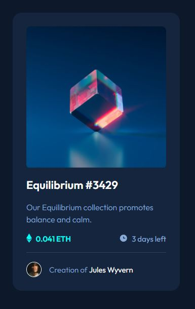

# Frontend Mentor - NFT preview card component solution

This is a solution to the [NFT preview card component challenge on Frontend Mentor](https://www.frontendmentor.io/challenges/nft-preview-card-component-SbdUL_w0U). Frontend Mentor challenges help you improve your coding skills by building realistic projects.

## Table of contents

- [Overview](#overview)
  - [The challenge](#the-challenge)
  - [Screenshot](#screenshot)
  - [Links](#links)
- [My process](#my-process)
  - [Built with](#built-with)
  - [What I learned](#what-i-learned)
- [Author](#author)

**Note: Delete this note and update the table of contents based on what sections you keep.**

## Overview

### The challenge

Users should be able to:

- View the optimal layout depending on their device's screen size
- See hover states for interactive elements

### Screenshot

### Links

- Solution URL: [https://github.com/abuk111/NFT-preview-card-component](https://github.com/abuk111/NFT-preview-card-component)
- Live Site URL: [https://abuk111.github.io/NFT-preview-card-component/index.html](https://abuk111.github.io/NFT-preview-card-component/index.html)

## My process

### Built with

- Semantic HTML5 markup
- SCSS, BEM
- Flexbox
- Mobile-first workflow

### What I learned

This is my second Frontend Mentor Challenge, which I completed. Although it seemed more difficult, I had fewer problems with completing it than challenge # 1. The most tricky was the hover action fragment, where the view icon was not transparent but background was. First, I try tu use opacity property, but afterwards I decided to keep it simply stupid and I add alpha challengge to background-color ;)

## Author

- Frontend Mentor - [@abuk111](https://www.frontendmentor.io/profile/abuk111)
- Twitter - [@Jakub Kulik](https://twitter.com/JakubKulik94)
